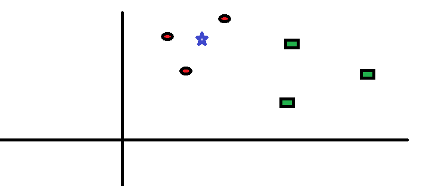

<h1 align='center'> K-nearest neighbour algorithm </h1>
<ol>

KNN can be used for both classification and regression predictive problems. However, it is more widely used in classification problems in the industry. To evaluate any technique we generally look at 3 important aspects:

  <li> Ease to interpret output </li>
  <li> Calculation time </li>
  <li> Predictive Power </li>
  </ol>

  
  
  <h2> How does the KNN algorithm work? </h2>
  
 Let’s take a simple case to understand this algorithm. Following is a spread of red circles (RC) and green squares (GS) :  
    
   The three closest points to BS is all RC. Hence, with a good confidence level, we can say that the BS should belong to the class RC. Here, the choice became very obvious as all three votes from the closest neighbor went to RC. The choice of the parameter K is very crucial in this algorithm. 
  
    

  <h2> How to use this algorithm? </h2>
   
 This algorithm can be easily used using jupyter notebook. Make sure that you have downloaded all the packages to run this algorithm although most of the packages are inbuilt with jupyter notebook. 

   
    
